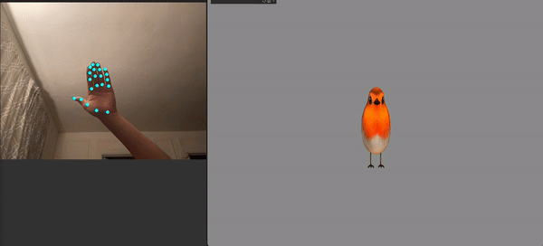

# live-puppetry
Ashley Kim (ayk2@andrew.cmu.edu)  
5/8/2023

This project is an experimentation of developing a real-time 3D animation pipeline based on tracked motion data through built-in webcam.
The application is built using openFrameworks and relies on an OSC application that can transmit MediaPipe ML hand tracking ML model data. 
For my demo, I used LingDong's [VisionOSC](https://github.com/LingDong-/VisionOSC).

## How to Use ##
Download the latest release to view the display of real-time controlled 3D model deformation.  
In order to control the model, please open the OSC sender application and connect to port 9527.

Hand closed gesture (fist) would squash the bird, while opening the hand would stretch the bird. 
The size and location of the bird is proportionally scaled to the detected hand's size and position. 

The viewport can be moved in 3D space. Scroll to zoom, left mouse click to rotate, and option+click to pan.

## Resources ##
* [3D bird mesh](https://sketchfab.com/3d-models/bird-orange-0d31748606c2499fb652c0c1052b7cfa) by Wen Yeh
